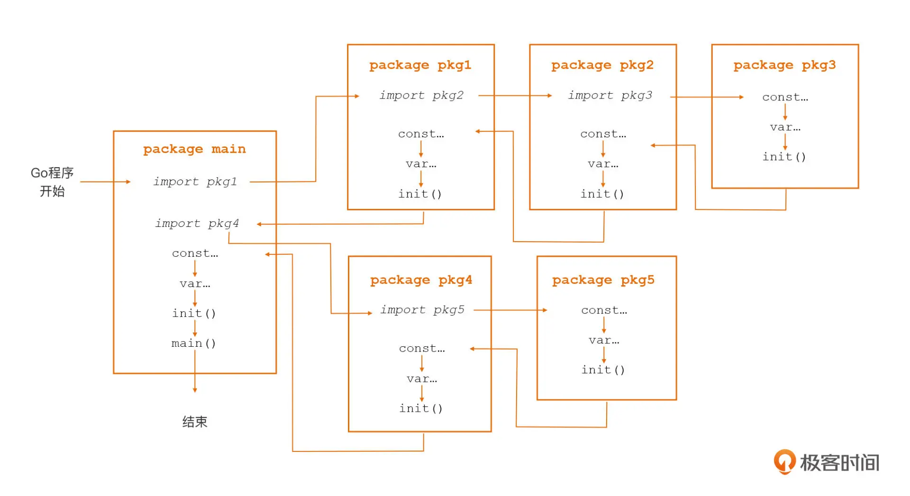

# Go 程序基础与 Go module 和 Go 项目文件夹结构

## 文件命名规范

- Go 源文件总是用全小写字母形式的短小单词命名，并且以 .go 扩展名结尾。
- 如果要在源文件的名字中使用多个单词，我们通常直接是将多个单词连接起来作为源文件名，而不是使用其他分隔符，比如下划线。也就是说，我们通常使用 helloworld.go 作为文件名而不是 hello_world.go。
- 尽量不要用两个以上的单词组合作为文件名，否则就很难分辨了。

## 程序结构

```go
package main
// 包是 go 语言的基本组成单元，通常使用单个的小写单词命名，一个 go 程序本质上就是一组包的集合。
// 
// * 整个 go 程序中仅允许存在一个 main 包。

import "fmt"
// fmt 表示的是标准库下的 fmt 目录

func main() {
    fmt.Println("hello, world")
  // 首字母为大写的标识符才是导出的（Exported），才能对包外的代码可见；如果首字母是小写的，那么就说明这个标识符仅限于在声明它的包内可见。
}
```

## 程序编译与运行

### 编译

`go build main.go`

### 直接运行

`go run main.go`

## 依赖管理 Go module

> Go module 是 Go 默认的包依赖管理机制和 Go 源码构建机制。

- 一个 module 就是一个包的集合，这些包和 module 一起打版本、发布和分发。go.mod 所在的目录被我们称为它声明的 module 的根目录。
- go.mod 记录直接依赖的包的信息
- go.sum 记录直接依赖和间接依赖包的相关版本的 hash 值，用来校验本地包的真实性。在构建的时候，如果本地依赖包的 hash 值与 go.sum 文件中记录的不一致，就会被拒绝构建。
- 安装的依赖遵循语义导入版本机制和最小版本选择机制

### .mod 文件内容示例

```go
module hellomodule

go 1.19

require (
  github.com/valyala/fasthttp v1.28.0
  go.uber.org/zap v1.18.1
)
```

### 配置国内代理

```bash
go env -w GOPROXY=https://goproxy.cn,direct # goproxy.cn
go env|grep GOPROXY # 验证
```

### 添加依赖

#### 自动添加缺失的依赖项

`go mod tidy`

#### 手动添加依赖项

`go get github.com/google/uuid`

#### 添加主版本号大于一的依赖项

`go get github.com/go-redis/redis/v7`

#### 查询依赖项的版本

```bash
go list -m -versions github.com/sirupsen/logrus

# github.com/sirupsen/logrus v0.1.0 v0.1.1 v0.2.0 v0.3.0 v0.4.0 v0.4.1 v0.5.0 v0.5.1 v0.6.0 v0.6.1 v0.6.2 v0.6.3 v0.6.4 v0.6.5 v0.6.6 v0.7.0 v0.7.1 v0.7.2 v0.7.3 v0.8.0 v0.8.1 v0.8.2 v0.8.3 v0.8.4 v0.8.5 v0.8.6 v0.8.7 v0.9.0 v0.10.0 v0.11.0 v0.11.1 v0.11.2 v0.11.3 v0.11.4 v0.11.5 v1.0.0 v1.0.1 v1.0.3 v1.0.4 v1.0.5 v1.0.6 v1.1.0 v1.1.1 v1.2.0 v1.3.0 v1.4.0 v1.4.1 v1.4.2 v1.5.0 v1.6.0 v1.7.0 v1.7.1 v1.8.0 v1.8.1
```

#### 安装依赖项的指定版本
  
```bash
go get github.com/sirupsen/logrus@v1.7.0

# go: downloading github.com/sirupsen/logrus v1.7.0
# go get: downgraded github.com/sirupsen/logrus v1.8.1 => v1.7.0
```

#### 使用 go mod 安装指定版本

```bash
go mod edit -require=github.com/sirupsen/logrus@v1.7.0

go mod tidy       
# go: downloading github.com/sirupsen/logrus v1.7.0
```

#### 列出当前 module 的所有依赖
  
`go list -m all`

#### 删除依赖项

从 import 里删除然后 `go mod tidy`

#### 特殊情况：使用 vendor

```bash
go mod vendor
tree -LF 2 vendor
```

```text
vendor
├── github.com/
│   ├── google/
│   ├── magefile/
│   └── sirupsen/
├── golang.org/
│   └── x/
└── modules.txt
```

如果存在 vendor 目录，构建时会默认启用`-mod=vendor`，如果不需要基于 vender 构建则需要指定 `-mod=mod`

### Q&A

#### module path 和 依赖安装位置

Go Module 的概念我还是不怎么理解,很多教程都用`github.com...` 做例子， 你说的是”路径“，路径不应该是
`（win10）"D:\goprojects\hellomodule"`吗？我自己自定义一个任意的名字也可以正常运行？我感觉很奇怪，为什么很多人用`githubcom/...`做module呢?
还有`go mod tidy` 命令后，下载的包在哪？在Go语言安装路径的src文件夹中？还是在哪?

  > 作者回复:
    1. 使用`github.com/...`作为module path是因为多数实用级module多是上传到github上的。用这种示例便于后续与真实生产接驳。但对于本地开发使用的简单示例程序而言，你说的没错。module path可以任意起，比如：`module demo1`也是ok的。
    2. go mod tidy下载的第三方包一般在GOPATH/pkg/mod下面。如果没有设置GOPATH环境变量，其默认值为你的home路径下的go文件夹。这样第三方包就在go文件夹的pkg/mod下面。

#### 空导入的作用？

  > 作者回复: 问题1：
  像下面代码这样的包导入方式被称为“空导入”：
  `import _ "foo"`
  空导入也是导入，意味着我们将依赖foo这个路径下的包。但由于是空导入，我们并没有显式使用这个包中的任何语法元素。那么空导入的意义是什么呢？由于依赖foo包，程序初始化的时候会沿着包的依赖链初始化foo包，我们在08里会讲到包的初始化会按照常量->变量->init函数的次序进行。通常实践中空导入意味着期望依赖包的init函数得到执行，这个init函数中有我们需要的逻辑。

## Go 项目的典型结构布局

- 放在项目顶层的 Go Module 相关文件，包括 go.mod 和 go.sum；
- cmd 目录：存放项目要编译构建的可执行文件所对应的 main 包的源码文件；
- 项目包目录：每个项目下的非 main 包都“平铺”在项目的根目录下，每个目录对应一个 Go 包；
- internal 目录：存放仅项目内部引用的 Go 包，这些包无法被项目之外引用；
- vendor 目录：这是一个可选目录，为了兼容 Go 1.5 引入的 vendor 构建模式而存在的。这个目录下的内容均由 Go 命令自动维护，不需要开发者手工干预。

### Go 可执行程序项目的典型结构布局

``` bash
tree -F exe-layout 
```

```text
exe-layout
├── cmd/ 
│   ├── app1/
│   │   └── main.go
│   └── app2/
│       └── main.go
├── go.mod
├── go.sum
├── internal/
│   ├── pkga/
│   │   └── pkg_a.go
│   └── pkgb/
│       └── pkg_b.go
├── pkg1/  
│   └── pkg1.go
├── pkg2/
│   └── pkg2.go
└── vendor/ 
```

#### 多 module
  
```bash
tree multi-modules
```

```text
multi-modules
├── go.mod // mainmodule
├── module1
│   └── go.mod // module1
└── module2
    └── go.mod // module2
```

#### 只有一个可执行程序要构建

```bash
tree -F -L 1 single-exe-layout
```

```text
single-exe-layout
├── go.mod
├── internal/
├── main.go
├── pkg1/
├── pkg2/
└── vendor/
```

### Go 库项目的典型结构布局

```bash
tree -F lib-layout 
```

```text
lib-layout
├── go.mod
├── internal/
│   ├── pkga/
│   │   └── pkg_a.go
│   └── pkgb/
│       └── pkg_b.go
├── pkg1/
│   └── pkg1.go
└── pkg2/
    └── pkg2.go
```

## Go程序的执行次序

### main.main 函数：Go 应用的入口函数

可执行程序的 main 包必须定义 main 函数，否则 Go 编译器会报错。在启动了多个 Goroutine（Go 语言的轻量级用户线程）的 Go 应用中，main.main 函数将在 Go 应用的主 Goroutine 中执行。

### init 函数：Go 包的初始化函数

```go
// 和 main.main 函数一样，init 函数也是一个无参数无返回值的函数：
func init() {
    // 包初始化逻辑
    ... ...
}
```

- 不能手动显式地调用 init，否则就会收到编译错误
- Go 包可以拥有不止一个 init 函数，每个组成 Go 包的 Go 源文件中，也可以定义多个 init 函数
- 在初始化 Go 包时，Go 会按照一定的次序，逐一、顺序地调用这个包的 init 函数。一般来说，先传递给 Go 编译器的源文件中的 init 函数，会先被执行；而同一个源文件中的多个 init 函数，会按声明顺序依次执行。

### Go 包的初始化次序

- 依赖包按“深度优先”的次序进行初始化；
- 每个包内按以“常量 -> 变量 -> init 函数”的顺序进行初始化；
- 包内的多个 init 函数按出现次序进行自动调用。



### init 函数的用途

#### 重置包级变量值

```go
var CommandLine = NewFlagSet(os.Args[0], ExitOnError)

func NewFlagSet(name string, errorHandling ErrorHandling) *FlagSet {
    f := &FlagSet{
        name:          name,
        errorHandling: errorHandling,
    }
    f.Usage = f.defaultUsage
    return f
}

func (f *FlagSet) defaultUsage() {
    if f.name == "" {
        fmt.Fprintf(f.Output(), "Usage:\n")
    } else {
        fmt.Fprintf(f.Output(), "Usage of %s:\n", f.name)
    }
    f.PrintDefaults()
}
```

```go
func init() {
    CommandLine.Usage = commandLineUsage // 重置CommandLine的Usage字段
}

func commandLineUsage() {
    Usage()
}

var Usage = func() {
    fmt.Fprintf(CommandLine.Output(), "Usage of %s:\n", os.Args[0])
    PrintDefaults()
}
```

### 实现对包级变量的复杂初始化

```go
var (
    http2VerboseLogs    bool // 初始化时默认值为false
    http2logFrameWrites bool // 初始化时默认值为false
    http2logFrameReads  bool // 初始化时默认值为false
    http2inTests        bool // 初始化时默认值为false
)

func init() {
    e := os.Getenv("GODEBUG")
    if strings.Contains(e, "http2debug=1") {
        http2VerboseLogs = true // 在init中对http2VerboseLogs的值进行重置
    }
    if strings.Contains(e, "http2debug=2") {
        http2VerboseLogs = true // 在init中对http2VerboseLogs的值进行重置
        http2logFrameWrites = true // 在init中对http2logFrameWrites的值进行重置
        http2logFrameReads = true // 在init中对http2logFrameReads的值进行重置
    }
}
```

#### 在 init 函数中实现“注册模式”

```go
import (
    "database/sql"
    _ "github.com/lib/pq"
)

func main() {
    db, err := sql.Open("postgres", "user=pqgotest dbname=pqgotest sslmode=verify-full")
    if err != nil {
        log.Fatal(err)
    }
    
    age := 21
    rows, err := db.Query("SELECT name FROM users WHERE age = $1", age)
    ...
}
```

```go
func init() {
    sql.Register("postgres", &Driver{})
}
```
