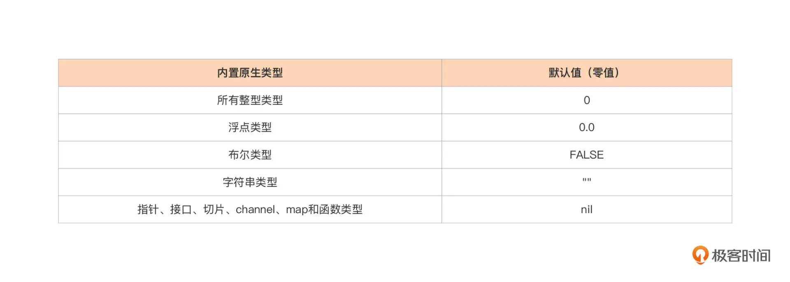
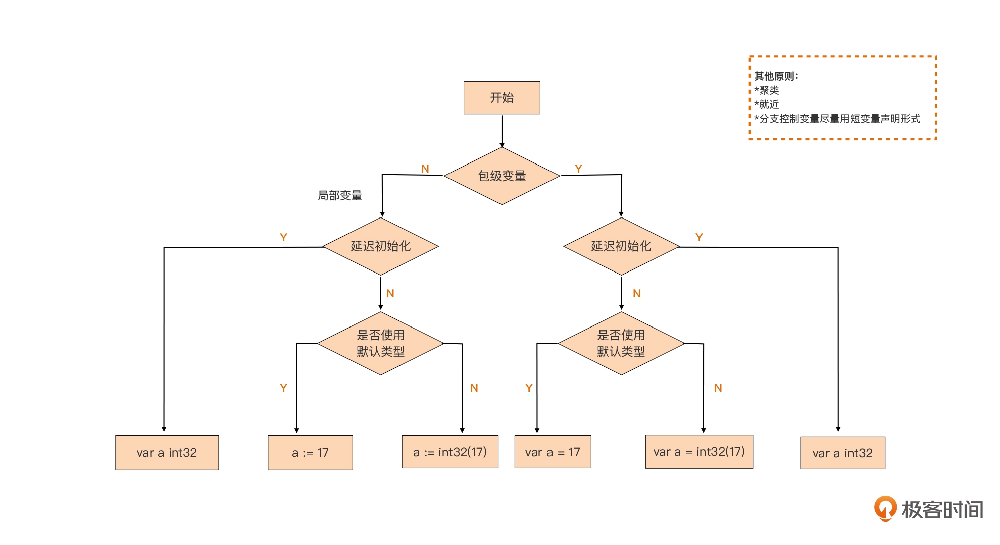

# 变量声明

- 包级变量 (package variable)只能使用带有 var 关键字的变量声明形式，不能使用短变量声明形式
- 局部变量 (local variable)，也就是 Go 函数或方法体内声明的变量，仅在函数或方法体内可见。可以使用短变量声明 `:=` 进行声明

## 声明方式

```go
var a int // a的初值为int类型的零值：0
```

内置原生类型的默认值（即零值）：



```go

### 变量声明块（block)

```go
var (
    a int = 128
    b int8 = 6
    s string = "hello"
    c rune = 'A'
    t bool = true
)
```

### 一行声明多个变量

```go
var a, b, c int = 5, 6, 7

var (
    a, b, c int = 5, 6, 7
    c, d, e rune = 'C', 'D', 'E'
)

```

### 省略类型信息的声明

```go
var b = 13 // 自动推导出变量的类型

var b = int32(13) // 显式类型转型

var a, b, c = 12, 'A', "hello" // 多个不同类型
```

### 短变量声明

```go
a := 12
b := 'A'
c := "hello"

a, b, c := 12, 'A', "hello"
```

## 包级变量的声明形式

```go
// $GOROOT/src/io/io.go
var ErrShortWrite = errors.New("short write")
var ErrShortBuffer = errors.New("short buffer")
var EOF = errors.New("EOF")

// 保持声明的一致性
var (
  a = 13
  b = int32(17)
  f = float32(3.14)
)

var a int32
var f float64
```

### 最佳实践：声明聚类

```go
// $GOROOT/src/net/net.go

var (
    netGo  bool 
    netCgo bool 
)

var (
    aLongTimeAgo = time.Unix(1, 0)
    noDeadline = time.Time{}
    noCancel   = (chan struct{})(nil)
)
```

### 最佳实践：就近原则

```go
// $GOROOT/src/net/http/request.go

var ErrNoCookie = errors.New("http: named cookie not present")
func (r *Request) Cookie(name string) (*Cookie, error) {
    for _, c := range readCookies(r.Header, name) {
        return c, nil
    }
    return nil, ErrNoCookie
}
```

## 局部变量的声明形式

```go
var err error

a := 17
f := 3.14
s := "hello, gopher!"

// 需要指定类型
a := int32(17)
f := float32(3.14)
s := []byte("hello, gopher!")
```

### 尽量在分支控制时使用短变量声明形式

```go
// $GOROOT/src/strings/strings.go
func LastIndexAny(s, chars string) int {
    if chars == "" {
        // Avoid scanning all of s.
        return -1
    }
    if len(s) > 8 {
        // 作者注：在if条件控制语句中使用短变量声明形式声明了if代码块中要使用的变量as和isASCII
        if as, isASCII := makeASCIISet(chars); isASCII { 
            for i := len(s) - 1; i >= 0; i-- {
                if as.contains(s[i]) {
                    return i
                }
            }
            return -1
        }
    }
    for i := len(s); i > 0; { 
        // 作者注：在for循环控制语句中使用短变量声明形式声明了for代码块中要使用的变量c
        r, size := utf8.DecodeLastRuneInString(s[:i])
        i -= size
        for _, c := range chars {
            if r == c {
                return i
            }
        }
    }
    return -1
}
```

### 如果有适合聚类的应用场景，应使用 var 来声明多于一个的局部变量

```go
// $GOROOT/src/net/dial.go
func (r *Resolver) resolveAddrList(ctx context.Context, op, network, 
                            addr string, hint Addr) (addrList, error) {
    ... ...
    var (
        tcp      *TCPAddr
        udp      *UDPAddr
        ip       *IPAddr
        wildcard bool
    )
   ... ...
}
```

## 代码块与作用域

> 和 js 基本一样😬

## 总结


